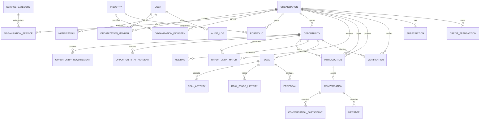

# TemuClient Database Schema

**Database:** PostgreSQL  
**ORM:** Prisma ORM 7  
**Model:** Multi-tenant by Organization  
**Version:** 1.0

---

## 1. Design Principles

- Normalize business entities.
- Keep buyer/provider organizations in one `Organization` model.
- Enforce tenant boundaries through organization IDs.
- Use independent verification records; never a single `verified` boolean.
- Store commercial history explicitly.
- Use a ledger for credits.
- Use explicit state enums.
- Store score algorithm versions.
- Add indexes for actual feed and pipeline queries.
- Soft-delete only where recovery/history requires it.

Recommended ID strategy: `cuid()` or UUID, used consistently.

---

## 2. Core ER Diagram



---

## 3. Enumerations

```text
UserStatus:
ACTIVE
INVITED
SUSPENDED
DISABLED

OrganizationType:
BUYER
PROVIDER
HYBRID

OrganizationRole:
OWNER
ADMIN
SALES
MEMBER

MembershipStatus:
INVITED
ACTIVE
SUSPENDED
REMOVED

ExperienceLevel:
BEGINNER
INTERMEDIATE
ADVANCED
EXPERT

ProviderAvailability:
AVAILABLE
LIMITED
UNAVAILABLE

PortfolioStatus:
DRAFT
PUBLISHED
ARCHIVED

VerificationStatus:
PENDING
VERIFIED
REJECTED
EXPIRED

VerificationType:
COMPANY
DOMAIN
CONTACT
REQUIREMENT
BUDGET
DECISION_MAKER

OpportunityStatus:
DRAFT
REVIEW
ACTIVE
PAUSED
MATCHING
IN_DISCUSSION
WON
CANCELLED
EXPIRED

OpportunityIntentLevel:
LOW
MEDIUM
HIGH
VERY_HIGH

ProjectType:
NEW_DEVELOPMENT
SYSTEM_REPLACEMENT
SYSTEM_INTEGRATION
CONSULTING
MANAGED_SERVICE
OUTSOURCING
AUDIT
IMPLEMENTATION
MIGRATION

RequirementPriority:
MUST_HAVE
SHOULD_HAVE
NICE_TO_HAVE

BudgetStatus:
ESTIMATED
APPROVED
FLEXIBLE
UNDISCLOSED

AttachmentVisibility:
BUYER_ONLY
INTRODUCED_PROVIDER
PUBLIC_SUMMARY

IntroductionStatus:
REQUESTED
ACCEPTED
DECLINED
CANCELLED
EXPIRED

DealStage:
INTRODUCTION
DISCOVERY
PROPOSAL
NEGOTIATION
WON
LOST

DealStatus:
OPEN
WON
LOST

MeetingStatus:
SCHEDULED
COMPLETED
CANCELLED
NO_SHOW

ProposalStatus:
DRAFT
SUBMITTED
ACCEPTED
REJECTED
WITHDRAWN

SubscriptionPlan:
FREE
PRO
BUSINESS

SubscriptionStatus:
TRIALING
ACTIVE
PAST_DUE
CANCELLED
EXPIRED

SubscriptionPaymentStatus:
PENDING
PAID
EXPIRED
FAILED
CANCELLED

NotificationType:
NEW_MATCH
INTRODUCTION_REQUESTED
INTRODUCTION_ACCEPTED
INTRODUCTION_DECLINED
MESSAGE
MEETING
PROPOSAL
OPPORTUNITY_UPDATED
VERIFICATION
DEAL_UPDATE
SYSTEM
```

---

## 4. User

```text
User
id
name
email
emailVerifiedAt
image
status
platformRole?
lastLoginAt
createdAt
updatedAt
```

Constraints:

- unique email.

Indexes:

- email;
- status.

Authentication secrets are stored separately from the user profile:

```text
UserCredential
id
userId
passwordHash
createdAt
updatedAt

Session
id
tokenHash
userId
activeOrganizationId?
expiresAt
lastUsedAt
createdAt

AuthToken
id
userId
purpose
tokenHash
expiresAt
usedAt?
createdAt
```

Session and one-time token values are never stored in plaintext. `AuthTokenPurpose` currently supports `EMAIL_VERIFICATION` and `PASSWORD_RESET`.

---

## 5. Organization

```text
Organization
id
name
slug
type
logoUrl
website
industryId?
companySize?
yearFounded?
description?
country
province?
city?
businessEmail?
phone?
companySize?
teamCapacity?
availability?
status
createdAt
updatedAt
```

Constraints:

- unique slug.

Initial active service catalog:

```text
Custom Software Development
Web Development
Mobile Development
ERP
CRM
AI Development
Data & Analytics
Cloud
DevOps
Cybersecurity
IT Outsourcing
UI/UX
System Integration
Digital Transformation
SaaS Implementation
```

This reference catalog is inserted by a production-safe Prisma migration. It
must not depend on the development seed, because staging and production never
run demo seed data. Service names, slugs, descriptions, active state, and sort
order are updated through reviewed migrations so Buyer and Provider onboarding
receive the same catalog in every environment.

Indexes:

- type;
- status;
- industryId;
- city.

Deletion:

- organizations should not be hard-deleted if commercial history exists.

Provider capability rules:

- `teamCapacity` is the number of concurrent delivery slots currently available;
- `availability` uses `ProviderAvailability` and is an input to future deterministic matching;
- these fields apply only to `PROVIDER` and `HYBRID` organizations.

---

## 6. OrganizationMember

```text
OrganizationMember
id
organizationId
userId
role
status
joinedAt
createdAt
updatedAt
```

Constraints:

- unique `(organizationId, userId)`.

Indexes:

- userId;
- organizationId + status.

---

## 7. Industry

```text
Industry
id
name
slug
parentId?
isActive
sortOrder
createdAt
updatedAt
```

Constraints:

- unique slug.

Supports hierarchy.

---

## 8. OrganizationIndustry

```text
OrganizationIndustry
organizationId
industryId
experienceLevel?
createdAt
```

Constraints:

- unique `(organizationId, industryId)`.

---

## 9. ServiceCategory

```text
ServiceCategory
id
name
slug
parentId?
description?
isActive
sortOrder
createdAt
updatedAt
```

Constraints:

- unique slug.

---

## 10. OrganizationService

```text
OrganizationService
id
organizationId
serviceCategoryId
description?
minProjectValue?
maxProjectValue?
currency
typicalDurationMin?
typicalDurationMax?
isPrimary
createdAt
updatedAt
```

Indexes:

- organizationId;
- serviceCategoryId;
- minProjectValue;
- maxProjectValue.

---

## 11. Technology

```text
Technology
id
name
slug
category?
createdAt
updatedAt
```

Constraints:

- unique slug.

---

## 12. Portfolio

```text
Portfolio
id
organizationId
title
slug
clientName?
isClientConfidential
industryId?
problem
solution
outcome?
projectValueMin?
projectValueMax?
currency
durationMonths?
startedAt?
completedAt?
status
createdAt
updatedAt
```

Constraints:

- unique `(organizationId, slug)`.

Indexes:

- organizationId;
- industryId;
- completedAt.

Status uses `PortfolioStatus`. Confidential portfolio DTOs must replace `clientName` with `Confidential {Industry} Company`; broad list/query responses must not serialize the private client name.

---

## 13. PortfolioTechnology

```text
PortfolioTechnology
portfolioId
technologyId
```

Constraints:

- unique `(portfolioId, technologyId)`.

---

## 14. Opportunity

```text
Opportunity
id
buyerOrganizationId
title
slug
serviceCategoryId
industryId
problemStatement
businessObjective?
description?
projectType
budgetMin?
budgetMax?
currency
budgetStatus?
timelineStart?
timelineEnd?
country
province?
city?
remoteAllowed
preferredProviderLocation?
intentScore
intentLevel
intentAlgorithmVersion
intentCalculatedAt?
verificationLevel
decisionMakerInvolved
status
publishedAt?
expiresAt?
createdById
createdAt
updatedAt
```

Constraints:

- unique `(buyerOrganizationId, slug)`.

Indexes:

- `(status, publishedAt DESC)`;
- `(serviceCategoryId, status)`;
- `(industryId, status)`;
- `(city, status)`;
- intentScore;
- expiresAt;
- buyerOrganizationId.

Privacy:

- do not expose buyer identity through provider feed unless policy allows.

Draft rules:

- `serviceCategoryId`, `industryId`, and `projectType` may be null while status is `DRAFT` or `REVIEW` so the conversational entry flow can autosave safely;
- publish validation requires these fields before entering `ACTIVE`;
- `decisionMakerInvolved` is an explicit Buyer Intent V1 input;
- `intentCalculatedAt` records when the stored deterministic score was calculated.

---

## 15. OpportunityRequirement

```text
OpportunityRequirement
id
opportunityId
category
label
description
priority
sortOrder
createdAt
updatedAt
```

Indexes:

- opportunityId;
- opportunityId + priority.

---

## 16. OpportunityAttachment

```text
OpportunityAttachment
id
opportunityId
name
storageKey
mimeType
size
visibility
uploadedById
createdAt
```

Visibility:

- BUYER_ONLY
- INTRODUCED_PROVIDER
- PUBLIC_SUMMARY

---

## 17. Verification

```text
Verification
id
organizationId?
opportunityId?
type
status
verifiedById?
verifiedAt?
expiresAt?
evidenceJson?
notes?
createdAt
updatedAt
```

Rules:

- one verification row represents one verification attempt/state.
- latest verified state may be resolved through query or status field.

Indexes:

- `(organizationId, type, status)`;
- `(opportunityId, type, status)`;
- `(status, createdAt)` for admin queue.

---

## 18. OpportunityMatch

### RiskFlag

```text
RiskFlag
id
organizationId?
opportunityId?
signal
severity
reason
source
metadataJson?
createdById?
resolvedById?
resolvedAt?
createdAt
updatedAt
```

V1 signals include manual review, duplicate submission, domain mismatch,
repeated rejection, and account status. A flag is an independent, auditable
signal and must never be collapsed into an organization or Opportunity boolean.

Indexes:

- `(organizationId, resolvedAt, createdAt)`;
- `(opportunityId, resolvedAt, createdAt)`;
- `(severity, resolvedAt, createdAt)`.

```text
OpportunityMatch
id
opportunityId
providerOrganizationId
totalScore
serviceScore
industryScore
budgetScore
portfolioScore
technologyScore
capacityScore
locationScore
availabilityScore
explanationJson?
algorithmVersion
calculatedAt
createdAt
updatedAt
```

Constraints:

- unique `(opportunityId, providerOrganizationId)`.

Indexes:

- `(providerOrganizationId, totalScore DESC)`;
- `(opportunityId, totalScore DESC)`.

---

## 19. SavedOpportunity

```text
SavedOpportunity
id
opportunityId
organizationId
savedById
createdAt
```

Constraints:

- unique `(opportunityId, organizationId)`.

---

## 20. Introduction

```text
Introduction
id
opportunityId
buyerOrganizationId
providerOrganizationId
requestedById
status
message?
fitSummary?
proposedApproach?
estimatedTimeline?
declineReason?
acceptedById?
acceptedAt?
declinedAt?
cancelledAt?
expiresAt?
createdAt
updatedAt
```

Constraints:

- prevent duplicate active introduction for same opportunity/provider.
- selected relevant portfolios are stored through `IntroductionPortfolio` and must belong to the Provider organization.

Indexes:

- `(buyerOrganizationId, status)`;
- `(providerOrganizationId, status)`;
- `(opportunityId, status)`.

### IntroductionPortfolio

```text
IntroductionPortfolio
introductionId
portfolioId
createdAt
```

Constraints:

- unique `(introductionId, portfolioId)`;
- portfolio must be `PUBLISHED` and owned by the requesting Provider at request time.

---

## 21. Conversation

```text
Conversation
id
opportunityId?
introductionId?
dealId?
createdAt
updatedAt
```

Constraints:

- accepted introduction should normally have one main conversation.

---

## 22. ConversationParticipant

```text
ConversationParticipant
conversationId
userId
organizationId
joinedAt
lastReadAt?
```

Constraints:

- unique `(conversationId, userId)`.

---

## 23. Message

```text
Message
id
conversationId
senderUserId
senderOrganizationId
body
type
replyToId?
createdAt
editedAt?
deletedAt?
```

Indexes:

- `(conversationId, createdAt)`;
- senderUserId.

Deletion:

- soft delete message content if moderation/recovery is needed.

---

## 24. Meeting

```text
Meeting
id
opportunityId?
introductionId?
dealId?
title
startsAt
endsAt
timezone
meetingProvider?
meetingUrl?
status
createdById
createdAt
updatedAt
```

Indexes:

- startsAt;
- dealId;
- opportunityId.

---

## 25. MeetingParticipant

```text
MeetingParticipant
id
meetingId
userId?
email
name
role?
attendanceStatus?
createdAt
```

---

## 26. Deal

```text
Deal
id
opportunityId
buyerOrganizationId
providerOrganizationId
ownerUserId
title
stage
status
estimatedValue?
currency
probability
expectedCloseDate?
wonAt?
lostAt?
lostReason?
createdAt
updatedAt
```

Indexes:

- `(providerOrganizationId, stage)`;
- `(ownerUserId, stage)`;
- expectedCloseDate;
- opportunityId.

Constraints:

- probability between 0 and 100.
- unique `(opportunityId, providerOrganizationId)` so one accepted Provider relationship initializes one Deal.
- estimated value must be non-negative when present.

---

## 27. DealStageHistory

```text
DealStageHistory
id
dealId
fromStage?
toStage
changedById
createdAt
```

Indexes:

- `(dealId, createdAt)`.

---

## 28. DealActivity

```text
DealActivity
id
dealId
userId
type
title
description?
metadataJson?
occurredAt
createdAt
```

Activity types:

- NOTE
- CALL
- EMAIL
- MEETING
- STAGE_CHANGE
- PROPOSAL
- SYSTEM

---

## 29. Proposal

```text
Proposal
id
dealId
version
title
summary?
amount?
currency
status
documentUrl?
submittedAt?
acceptedAt?
rejectedAt?
createdById
createdAt
updatedAt
```

Constraints:

- unique `(dealId, version)`.
- version is a positive integer and amount must be non-negative when present.

---

## 30. Review

```text
Review
id
reviewerOrganizationId
reviewedOrganizationId
opportunityId?
dealId?
communicationRating
professionalismRating
capabilityRating
proposalRating?
comment?
status
createdAt
updatedAt
```

Only allow review after legitimate interaction.

---

## 31. Notification

```text
Notification
id
userId
type
title
body
entityType?
entityId?
readAt?
createdAt
```

Indexes:

- `(userId, readAt, createdAt DESC)`.

---

## 32. Subscription

```text
Subscription
id
organizationId
plan
status
provider
providerCustomerId?
providerSubscriptionId?
periodStart?
periodEnd?
cancelAtPeriodEnd
createdAt
updatedAt
```

Constraints:

- one active primary subscription per organization.

### SubscriptionPayment

```text
SubscriptionPayment
id
organizationId
subscriptionId?
createdById?
plan
billingPeriodMonths
amount (BigInt IDR)
currency
method (QRIS)
status
provider
providerOrderId
providerTransactionId?
qrisImageUrl?
expiresAt
paidAt?
failureReason?
createdAt
updatedAt
```

Each record is an immutable commercial invoice attempt except for provider
status fields. A paid QRIS invoice extends the subscription period in one
transaction. Provider order and transaction IDs are unique.

### EntitlementUsage

```text
EntitlementUsage
id
organizationId
feature
periodStart
entityId
createdAt
```

The unique `(organizationId, feature, periodStart, entityId)` key makes monthly
usage consumption idempotent. V1 uses it for distinct Opportunity access per
calendar month; repeatedly viewing the same Opportunity does not consume
another unit.

---

## 33. CreditTransaction

```text
CreditTransaction
id
organizationId
type
amount
referenceType?
referenceId?
description?
createdAt
```

Do not store balance as the only source of truth.

Balance = sum of ledger transactions.

### BillingWebhookEvent

```text
BillingWebhookEvent
id
provider
providerEventId
eventType
payloadHash
processedAt?
errorMessage?
createdAt
```

`(provider, providerEventId)` is unique so provider retries are idempotent.

### AnalyticsEvent

```text
AnalyticsEvent
id
name
userId?
organizationId?
entityType?
entityId?
propertiesJson?
occurredAt
createdAt
```

Indexes support event/time, organization funnel, and entity timelines. Event
properties must not contain secrets, raw messages, private files, or raw prompts.

---

## 34. AuditLog

```text
AuditLog
id
actorUserId?
actorOrganizationId?
action
entityType
entityId
beforeJson?
afterJson?
metadataJson?
ipAddress?
userAgent?
createdAt
```

Indexes:

- `(entityType, entityId, createdAt)`;
- actorUserId;
- createdAt.

---

## 35. AIExecution

```text
AIExecution
id
organizationId?
userId?
feature
provider
model
inputTokens?
outputTokens?
latencyMs?
cost?
status
entityType?
entityId?
createdAt
```

Avoid storing raw sensitive prompt data unless explicitly required.

---

## 36. Prisma Skeleton

```prisma
generator client {
  provider = "prisma-client-js"
}

datasource db {
  provider = "postgresql"
  url      = env("DATABASE_URL")
}

enum OrganizationType {
  BUYER
  PROVIDER
  HYBRID
}

enum OrganizationRole {
  OWNER
  ADMIN
  SALES
  MEMBER
}

enum OpportunityStatus {
  DRAFT
  REVIEW
  ACTIVE
  PAUSED
  MATCHING
  IN_DISCUSSION
  WON
  CANCELLED
  EXPIRED
}

enum IntroductionStatus {
  REQUESTED
  ACCEPTED
  DECLINED
  CANCELLED
  EXPIRED
}

enum DealStage {
  INTRODUCTION
  DISCOVERY
  PROPOSAL
  NEGOTIATION
  WON
  LOST
}

model User {
  id              String   @id @default(cuid())
  name            String?
  email           String   @unique
  emailVerifiedAt DateTime?
  image           String?
  status          String   @default("ACTIVE")
  lastLoginAt     DateTime?
  createdAt       DateTime @default(now())
  updatedAt       DateTime @updatedAt

  memberships     OrganizationMember[]
}

model Organization {
  id            String           @id @default(cuid())
  name          String
  slug          String           @unique
  type          OrganizationType
  logoUrl       String?
  website       String?
  description   String?
  country       String           @default("Indonesia")
  province      String?
  city          String?
  businessEmail String?
  phone         String?
  status        String           @default("ACTIVE")
  createdAt     DateTime         @default(now())
  updatedAt     DateTime         @updatedAt

  members       OrganizationMember[]
  opportunities Opportunity[]    @relation("BuyerOpportunities")
}

model OrganizationMember {
  id             String           @id @default(cuid())
  organizationId String
  userId         String
  role           OrganizationRole
  status         String           @default("ACTIVE")
  joinedAt       DateTime         @default(now())

  organization   Organization     @relation(fields: [organizationId], references: [id])
  user           User             @relation(fields: [userId], references: [id])

  @@unique([organizationId, userId])
  @@index([userId])
}

model Opportunity {
  id                  String            @id @default(cuid())
  buyerOrganizationId String
  title               String
  slug                String
  problemStatement    String
  description         String?
  budgetMin           BigInt?
  budgetMax           BigInt?
  currency            String            @default("IDR")
  intentScore         Int               @default(0)
  verificationLevel   Int               @default(0)
  status              OpportunityStatus @default(DRAFT)
  publishedAt         DateTime?
  expiresAt           DateTime?
  createdAt           DateTime          @default(now())
  updatedAt           DateTime          @updatedAt

  buyerOrganization   Organization      @relation("BuyerOpportunities", fields: [buyerOrganizationId], references: [id])

  @@unique([buyerOrganizationId, slug])
  @@index([status, publishedAt])
  @@index([intentScore])
  @@index([expiresAt])
}
```

The actual implementation must expand this skeleton to all entities described in this document.

---

## 37. Deletion Strategy

Hard delete:

- drafts without commercial history;
- taxonomy items only when unused.

Soft delete or retain history:

- organizations;
- messages;
- opportunities with interactions;
- deals;
- proposals.

Immutable:

- audit logs;
- stage history;
- credit ledger.

---

## 38. Privacy Boundaries

Provider-feed queries must not return:

- buyer email;
- phone;
- private document storage key;
- private contact;
- decision-maker identity unless allowed.

Use dedicated DTO projection, not `include: true` on broad relations.

---

## 39. Money

For IDR:

- prefer `BigInt` in rupiah if no fractional currency is required.

If multi-currency fractional amounts become necessary:

- use PostgreSQL `Decimal`.

Do not use floating-point money.

---

## 40. Time

Store UTC timestamps.

Display using user timezone.

Default initial locale timezone:
`Asia/Jakarta`.

---

## 41. Article Content

`Article` stores editorial Markdown and search/discovery metadata:

```text
Article
id
slug (unique)
title
description
contentMarkdown
authorName
authorUserId?
category
tags[]
keywords[]
readingTimeMinutes
status: DRAFT | PUBLISHED | ARCHIVED
publishedAt?
createdAt
updatedAt
```

Indexes:
- unique slug;
- status + publishedAt for public feeds;
- category + status for editorial filtering.

Articles are not tenant-owned commercial data. Mutations are restricted to
platform `SUPER_ADMIN` and `ADMIN` roles and create immutable audit entries.
Draft and archived records must never appear in public DTOs, sitemap, RSS, or
AI-oriented discovery files.

---

## 42. Related Documents

- `SYSTEM_DESIGN.md`
- `API_CONTRACT.md`
- `USER_FLOWS.md`
- `SCREEN_SPECIFICATIONS.md`
