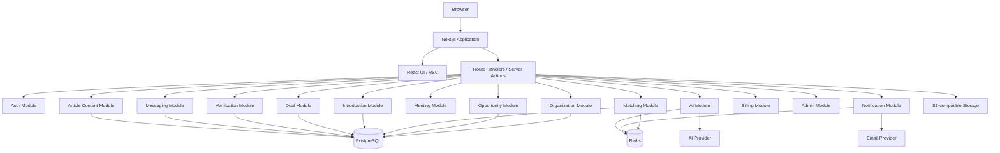
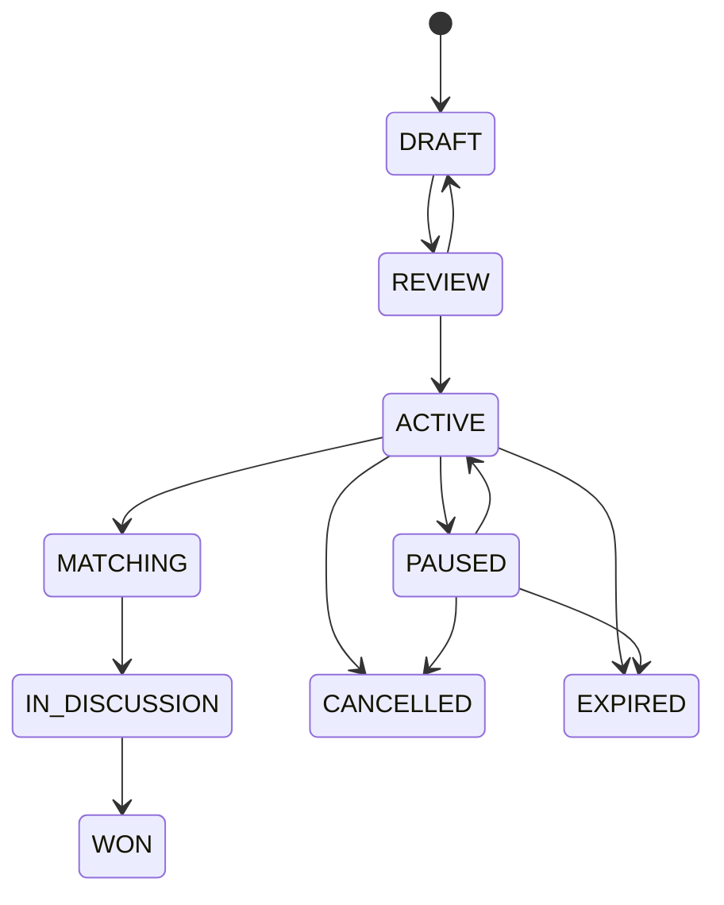
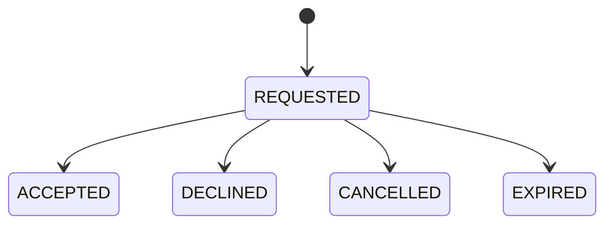

# TemuClient System Design

**Version:** 1.0  
**Architecture Style:** Modular Monolith  
**Primary Stack:** Next.js 16, TypeScript, PostgreSQL, Prisma ORM 7, Redis, S3-compatible storage

---

## 1. Goals

The V1 architecture must optimize for:

- fast product iteration;
- strong domain boundaries;
- predictable authorization;
- transactional integrity;
- future service extraction;
- auditability;
- privacy by default;
- deterministic matching;
- explicit workflow state transitions.

The system must support the core flow:

```text
Need → Qualification → Match → Introduction → Meeting → Deal
```

---

## 2. High-Level Architecture



---

## 3. Architectural Style

Use a **modular monolith**.

Reasons:
- V1 domain is still evolving;
- transactional workflows span multiple modules;
- early marketplace operations require rapid change;
- microservices would introduce unnecessary operational complexity.

Modules should expose services through explicit interfaces, making later extraction possible.

---

## 4. Recommended Source Structure

```text
src/
  app/
    (marketing)/
    (auth)/
    (provider)/
    (buyer)/
    admin/
    api/v1/

  components/
    ui/
    shared/
    opportunity/
    company/
    matching/
    introduction/
    deals/
    messaging/
    ai/

  modules/
    auth/
    users/
    organizations/
    companies/
    services/
    portfolio/
    opportunities/
    verification/
    matching/
    introductions/
    conversations/
    meetings/
    deals/
    proposals/
    notifications/
    subscriptions/
    ai/
    admin/
    audit/
    analytics/

  server/
    db/
    auth/
    redis/
    storage/
    email/
    queue/

  lib/
    permissions/
    validators/
    analytics/
    money/
    dates/
    errors/

prisma/
  schema.prisma
  seed.ts

docs/
```

---

## 5. Module Contract

Each domain module should contain, where relevant:

```text
types.ts
schema.ts
repository.ts
service.ts
permissions.ts
validators.ts
events.ts
api.ts
```

Rules:
- React components must not contain major business logic.
- Route handlers call services.
- Services enforce domain rules.
- Repositories handle persistence.
- Permission checks exist server-side.
- Events decouple secondary effects.

---

## 6. Core Modules

### Authentication
Responsible for:
- login;
- registration;
- session;
- password reset;
- email verification.

### Organizations
Responsible for:
- buyer/provider company account;
- members;
- role assignments;
- organization settings.

### Opportunities
Responsible for:
- buyer requirement lifecycle;
- publication;
- visibility;
- expiration;
- structured requirements.

### Verification
Responsible for:
- company;
- domain;
- contact;
- requirement;
- budget;
- decision-maker verification.

### Matching
Responsible for:
- deterministic score;
- match breakdown;
- algorithm version;
- candidate provider selection.

### Introductions
Responsible for:
- provider introduction request;
- buyer approval;
- privacy unlock;
- conversation activation.

### Messaging
Responsible for:
- authorized conversation;
- message persistence;
- unread state.

### Meetings
Responsible for:
- meeting scheduling;
- participants;
- provider link;
- status.

### Deals
Responsible for:
- pipeline;
- stage transitions;
- value;
- probability;
- activities;
- win/loss.

### AI
Responsible for:
- provider abstraction;
- structured generation;
- logging;
- rate limits;
- safety boundaries.

### Notifications
Responsible for:
- in-app notification;
- email dispatch;
- preferences.

### Article Content
Responsible for:
- validated Markdown ingestion through the Admin Console;
- draft, published, and archived editorial states;
- public semantic rendering without executing raw HTML;
- canonical metadata, Article/Breadcrumb/FAQ structured data;
- discovery through sitemap, RSS, and `llms.txt`;
- an audit record for every create or update mutation.

Article Markdown is stored in PostgreSQL. Public projections return only
`PUBLISHED` content whose publication timestamp has been reached. Uploaded
files are parsed in memory and are not stored as public objects.

### Admin
Responsible for:
- moderation;
- verification queue;
- reporting;
- suspension;
- audit access.

V1 risk signals are persisted as independent `RiskFlag` records linked to an
organization and/or Opportunity. Admin mutations capture actor, before/after,
request IP, and user-agent in `AuditLog`. Suspension is enforced by mutation
authorization guards while existing records remain readable.

---

## 7. Authentication

Recommended session model:
- secure HTTP-only session cookie;
- server-side session validation;
- CSRF protection where relevant;
- rotation on privilege changes.

Authentication and organization authorization are separate concerns.

Never infer access solely from authenticated status.

---

## 8. Authorization

Authorization uses:
1. platform role;
2. organization membership;
3. organization role;
4. entity relationship;
5. entity state.

Example:

A Provider Sales member may request an introduction only if:
- they belong to the provider organization;
- opportunity is ACTIVE;
- provider has a match;
- no existing active introduction;
- provider organization is not suspended.

---

## 9. RBAC

Organization roles:

```text
OWNER
ADMIN
SALES
MEMBER
```

Platform roles:

```text
SUPER_ADMIN
ADMIN
MODERATOR
```

See `API_CONTRACT.md` and `SCREEN_SPECIFICATIONS.md` for per-action permissions.

---

## 10. Data Privacy Model

Before accepted introduction, providers must not receive:
- buyer direct email;
- buyer phone;
- hidden buyer organization identity;
- private attachments;
- decision-maker personal information.

Visibility rules are enforced in query/service layers, not only in UI.

Recommended response DTOs:
- `OpportunityPublicDTO`
- `OpportunityProviderDTO`
- `OpportunityBuyerDTO`
- `OpportunityAdminDTO`

---

## 11. Opportunity State Machine



Invalid transitions must return domain errors.

---

## 12. Introduction State Machine



Accepting an introduction should happen transactionally.

Transaction:
1. lock introduction;
2. validate state;
3. set `ACCEPTED`;
4. create conversation;
5. optionally create initial deal;
6. create audit record;
7. create domain event.

---

## 13. Deal State Machine

Stages:

```text
INTRODUCTION
DISCOVERY
PROPOSAL
NEGOTIATION
WON
LOST
```

Transitions should be explicit.

Do not allow a closed deal to return to an active stage without privileged reopening logic.

---

## 14. Matching Engine

V1 uses deterministic weighted matching.

Weights:

| Factor | Weight |
|---|---:|
| Service Compatibility | 25 |
| Industry Experience | 15 |
| Budget Compatibility | 15 |
| Portfolio Relevance | 15 |
| Technology Capability | 10 |
| Company Capacity | 10 |
| Location | 5 |
| Availability | 5 |

Interface:

```ts
interface MatchingEngine {
  calculate(
    opportunity: OpportunityProfile,
    provider: ProviderProfile
  ): Promise<MatchResult>
}
```

Store:
- total score;
- factor scores;
- reasons;
- algorithm version.

AI may explain the score but must not replace the deterministic scoring engine in V1.

---

## 15. Buyer Intent Engine

Weights:

| Factor | Weight |
|---|---:|
| Requirement Completeness | 20 |
| Budget | 20 |
| Timeline | 15 |
| Decision Maker | 15 |
| Company Verification | 10 |
| Buyer Activity | 10 |
| Urgency | 10 |

Store:
- score;
- level;
- version;
- calculatedAt.

Recalculate on meaningful opportunity updates.

---

## 16. Search

V1:
- PostgreSQL filtering;
- indexed columns;
- full-text search for opportunity title/description where required.

Future:
- Typesense / Meilisearch / Elasticsearch.

Opportunity filters:
- service;
- industry;
- budget;
- city;
- intent;
- verification;
- match;
- project type.

Filter state should be serializable in URL query parameters.

---

## 17. Redis

Use Redis for:
- short-lived cache;
- rate limits;
- idempotency keys;
- job coordination;
- notification queue foundation;
- match recalculation queue foundation;
- AI throttling.

Do not store source-of-truth commercial state only in Redis.

---

## 18. Background Jobs

V1 can initially run some jobs synchronously if workload is low, but design queue-ready interfaces for:
- match generation;
- match recalculation;
- AI generation;
- email delivery;
- opportunity expiration;
- notification fanout;
- verification reminder.

Potential job shape:

```ts
type Job<T> = {
  id: string
  type: string
  payload: T
  createdAt: string
}
```

---

## 19. Domain Events

Recommended internal events:

```text
OrganizationVerified
OpportunityPublished
OpportunityUpdated
OpportunityMatched
IntroductionRequested
IntroductionAccepted
IntroductionDeclined
MeetingScheduled
MeetingCompleted
ProposalSubmitted
DealStageChanged
DealWon
DealLost
```

Handlers can create:
- notification;
- email;
- analytics event;
- audit event;
- follow-up job.

Keep domain actions independent from specific delivery channels.

---

## 20. AI Layer

Provider abstraction:

```ts
interface AIProvider {
  generateText(input: GenerateTextInput): Promise<GenerateTextResult>
  generateObject<T>(input: GenerateObjectInput<T>): Promise<T>
  embed?(input: EmbedInput): Promise<EmbedResult>
}
```

Features:
- requirement analysis;
- question generation;
- structured requirement;
- opportunity summary;
- match explanation;
- meeting preparation;
- discovery analysis;
- follow-up;
- proposal outline;
- deal health.

Requirements:
- Zod validation;
- authorization;
- usage logging;
- rate limits;
- no autonomous send;
- minimize storage of sensitive prompt data.

V1 provider selection is environment-based. `deterministic` is the labelled local fallback and `openai` is the initial production adapter; domain services depend only on `AIProvider`, so additional vendors can be registered without changing feature services.

---

## 21. Object Storage

Use S3-compatible storage for:
- logo;
- portfolio images;
- opportunity attachments;
- proposals.

Preferred flow:
1. authenticated client requests signed upload;
2. server checks allowed type/size;
3. client uploads directly;
4. application stores metadata;
5. private files use signed download URLs.

Do not trust filename extension.

---

## 22. Notifications

Channels:
- in-app;
- email.

Notification entity is persistent.

Example events:
- new match;
- introduction accepted;
- message received;
- meeting reminder;
- proposal requested;
- verification update.

Future channels:
- WhatsApp;
- mobile push.

---

## 23. Transactions

Use database transactions for workflows including:

### Accept Introduction
- update introduction;
- create conversation;
- create participants;
- create deal if configured;
- create audit log.

### Mark Deal Won
- update deal;
- stage history;
- activity;
- review eligibility;
- analytics.

### Publish Opportunity
- validate completeness;
- update state;
- calculate intent;
- create audit;
- dispatch matching event.

---

## 24. Idempotency

Required for:
- introduction acceptance;
- payment webhooks;
- AI requests where retried;
- meeting integration callbacks;
- subscription callbacks.

Use idempotency keys stored with expiry where appropriate.

---

## 25. Error Model

Domain errors should be typed.

Example:

```ts
class DomainError extends Error {
  code: string
  status: number
  fieldErrors?: Record<string, string>
}
```

Examples:
- `OPPORTUNITY_NOT_FOUND`
- `OPPORTUNITY_NOT_ACTIVE`
- `INTRODUCTION_ALREADY_EXISTS`
- `INTRODUCTION_INVALID_STATE`
- `FORBIDDEN`
- `ORGANIZATION_SUSPENDED`

Never expose internal stack traces to API clients.

---

## 26. Observability

Required:
- structured logs;
- request IDs;
- actor ID;
- organization ID where applicable;
- error tracking;
- AI usage logs;
- audit logs.

Avoid logging:
- passwords;
- access tokens;
- private attachments;
- unnecessary message content.

---

## 27. Security

Required:
- secure session cookies;
- server-side authorization;
- rate limiting;
- Zod validation;
- file validation;
- signed file access;
- CSRF protection where relevant;
- XSS-safe output;
- ORM parameterization;
- security headers;
- audit logs;
- tenant boundary tests.

Sensitive data should never be exposed through generic serializers.

---

## 28. Performance Targets

- Initial page load: < 2.5s target
- Common API P95: < 500ms excluding AI/external services
- Search: < 1s
- Common mutation perceived response: < 300ms where optimistic UI is safe

---

## 29. Database Indexing

Core indexes:

```text
Opportunity(status, publishedAt)
Opportunity(serviceCategoryId, status)
Opportunity(industryId, status)
Opportunity(city, status)
Opportunity(intentScore)
Opportunity(expiresAt)

OpportunityMatch(providerOrganizationId, totalScore)
OpportunityMatch(opportunityId, totalScore)

Deal(providerOrganizationId, stage)
Deal(ownerUserId, stage)
Deal(expectedCloseDate)

Message(conversationId, createdAt)

Notification(userId, readAt, createdAt)
```

See `DATABASE_SCHEMA.md`.

---

## 30. Scaling Path

When scale requires extraction, likely candidates:
1. messaging;
2. notifications;
3. AI workloads;
4. matching;
5. search.

The modular monolith should keep these behind service boundaries from day one.

---

## 31. Testing Strategy

Unit:
- matching score;
- buyer intent;
- permissions;
- state transitions;
- privacy DTOs.

Integration:
- publish opportunity;
- request introduction;
- accept introduction;
- create conversation;
- schedule meeting;
- deal progression.

E2E:
- Buyer end-to-end journey;
- Provider end-to-end journey;
- Admin verification flow.

---

## 32. Deployment Model

Recommended initial production topology:

```text
CDN / Edge
   ↓
Next.js App
   ↓
PostgreSQL
Redis
S3-compatible Storage
Email Provider
AI Provider
```

Infrastructure should use environment-based configuration.

The approved Google Cloud profile preserves this topology with Cloud Run for the
standalone application, Cloud SQL for PostgreSQL, Artifact Registry/Cloud Build
for immutable images, Secret Manager for credentials, and a separate Cloud Run
Job for migrations. Redis may be Memorystore through private Direct VPC egress
or a TLS-managed Redis provider. Cloud Storage is used only through its private
XML API/HMAC compatibility surface until a native storage adapter is approved.
See `GOOGLE_CLOUD_DEPLOYMENT.md` for the controlled procedure.

---

## 33. Environment Variables

Minimum groups:

```text
DATABASE_URL=
REDIS_URL=

AUTH_SECRET=
APP_URL=

S3_ENDPOINT=
S3_REGION=
S3_BUCKET=
S3_ACCESS_KEY_ID=
S3_SECRET_ACCESS_KEY=

EMAIL_PROVIDER=
EMAIL_FROM=

AI_PROVIDER=
OPENAI_API_KEY=
ANTHROPIC_API_KEY=
GEMINI_API_KEY=
```

Only required provider keys should be mandatory at runtime.

Production runtime validation is conditional by provider and environment.
`APP_ENV` distinguishes development, test, staging, and production while
`NODE_ENV` remains the framework runtime mode. Production requires HTTPS,
private S3 storage, transactional email, a non-example auth secret, and a
billing webhook secret.

## 34. Production Boundaries

- Redis keys are namespaced by product version and environment. Commercial
  state never depends on Redis; production rate-limit failure is fail-closed.
- Storage uses private organization-scoped opaque keys, bounded POST policies,
  and short-lived authorized download URLs.
- Transactional email is behind a provider interface; local `log` mode records
  only safe metadata and never token URLs or email bodies.
- Subscription billing is behind a provider interface. Provider plans use one
  dynamic QRIS invoice per period through Midtrans; there is no deal success
  fee. Paid plans are feature-flagged, sandbox is explicitly labelled, and
  signed webhook events are idempotent. A plan activates only after the stored
  amount and verified provider settlement agree.
- A centralized effective-plan resolver treats inactive or past-period plans as
  `FREE`. Domain/API boundaries—not component visibility—enforce Opportunity
  usage, Provider AI Sales, Match Intelligence, advanced analytics, and team
  seats. Priority matching is intentionally disabled: subscription never
  changes the deterministic Match Score or buyer shortlist ranking.
- Analytics events are stored with the domain mutation where practical and feed
  the Qualified Introductions per Month North Star.
- Requests receive a request ID, security headers, structured sanitized logs,
  and liveness/readiness probes.

---

## 35. Related Documents

- `DESIGN_SYSTEM.md`
- `DATABASE_SCHEMA.md`
- `API_CONTRACT.md`
- `USER_FLOWS.md`
- `SCREEN_SPECIFICATIONS.md`
- `PRODUCTION_RUNBOOK.md`
- `LAUNCH_CHECKLIST.md`
