# TemuClient User Flows

**Version:** 1.0  
**Primary Principle:** Need → Match → Introduction → Meeting → Deal

---

## 1. User Roles

- Buyer
- Provider Owner/Admin
- Provider Sales
- Organization Member
- Platform Admin

---

## 2. Provider Onboarding

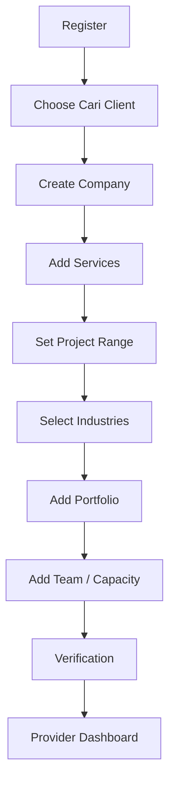

### Exit Criteria

Provider can access opportunity feed when:
- organization exists;
- at least one service exists;
- profile reaches minimum completeness;
- account is not suspended.

---

## 3. Buyer Onboarding

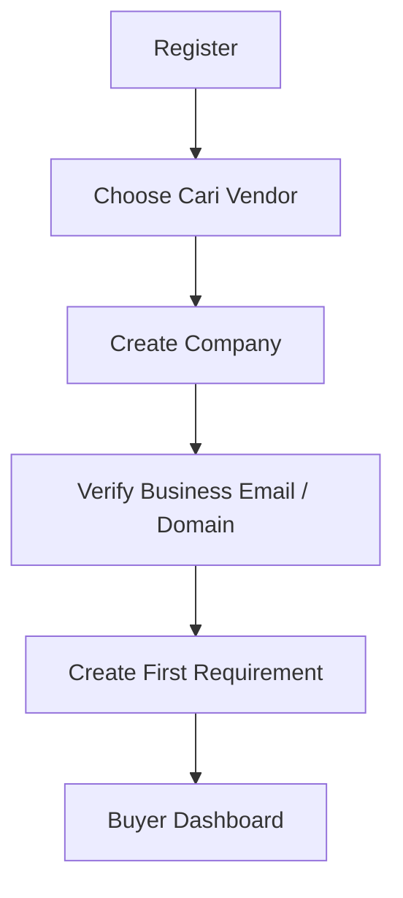

Goal: move buyer to first requirement with minimum friction.

---

## 4. Create Requirement

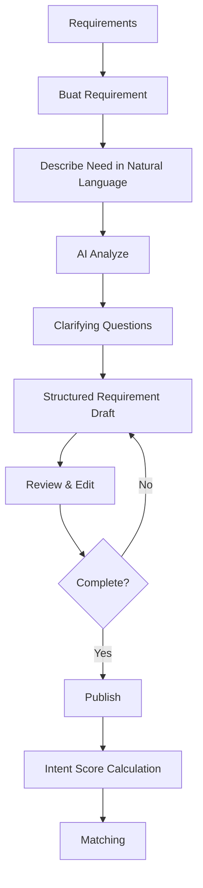

Rules:
- AI never auto-publishes.
- Buyer must review final structured output.
- Draft autosaves.

---

## 5. Opportunity Matching

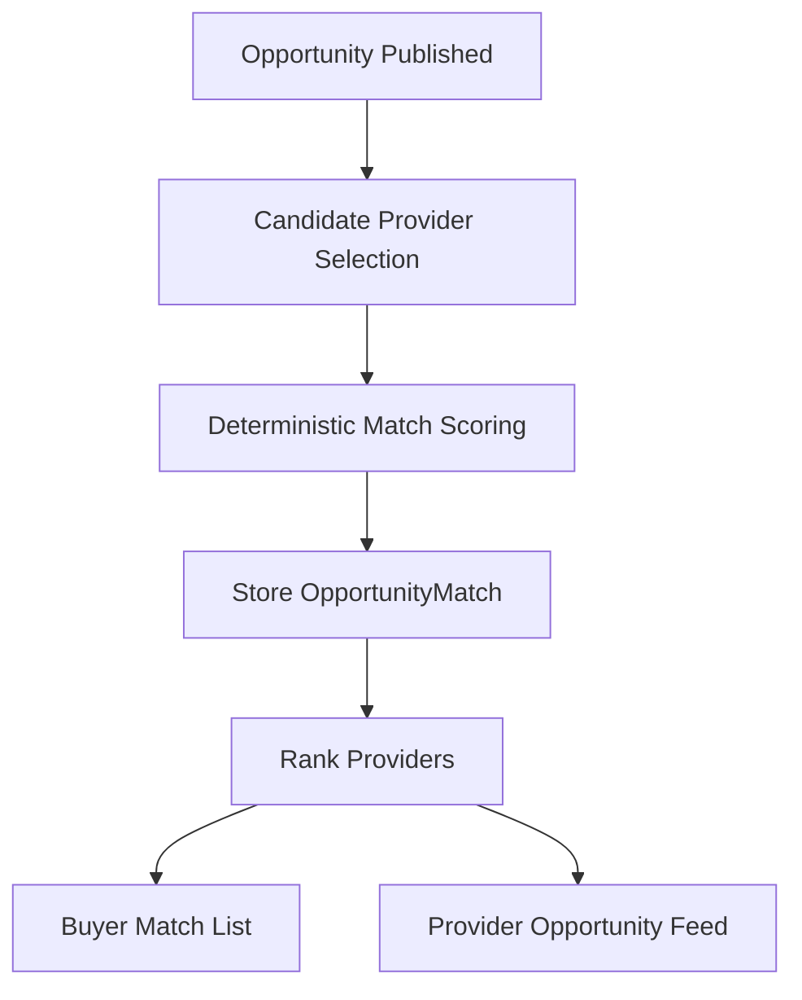

Provider sees safe data only.

---

## 6. Provider Opportunity Review

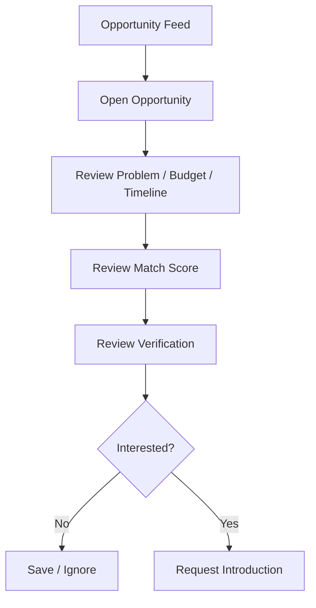

---

## 7. Request Introduction

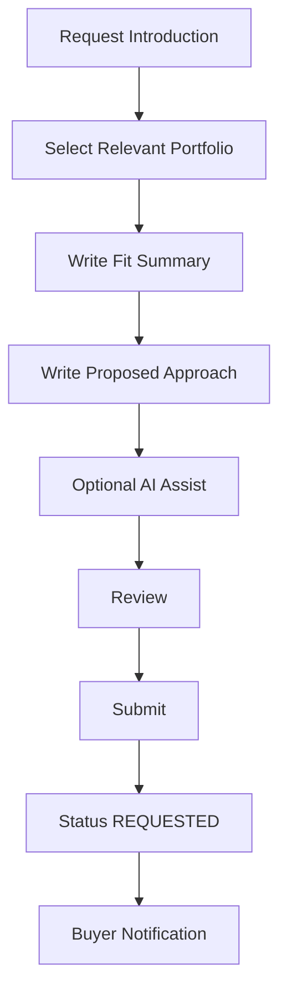

Rules:
- AI content must be reviewed.
- Duplicate active request is blocked.

---

## 8. Buyer Reviews Provider

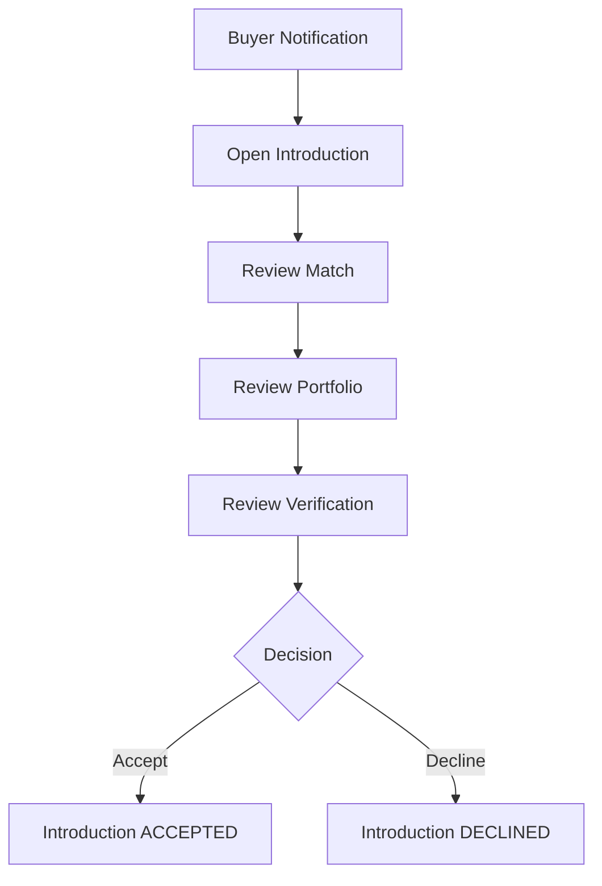

---

## 9. Accept Introduction

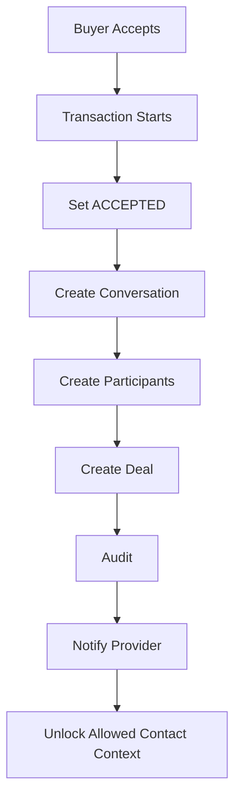

---

## 10. Messaging

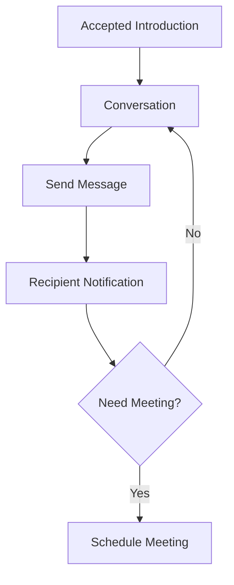

---

## 11. Meeting Flow

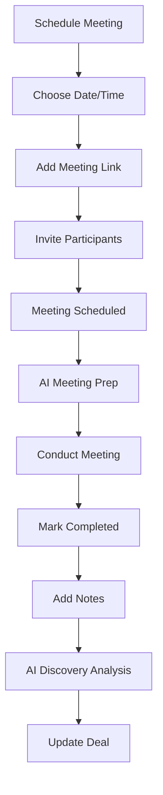

---

## 12. Deal Progression

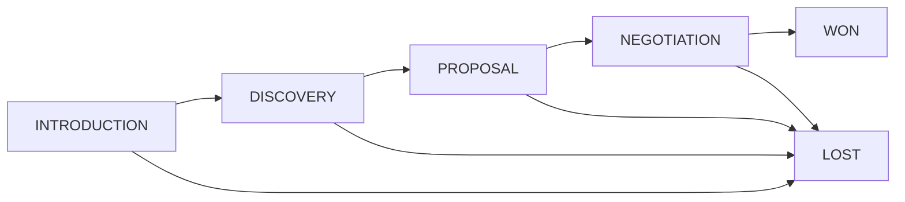

Each transition:
- validates;
- writes stage history;
- creates activity;
- emits analytics event.

---

## 13. Proposal Flow

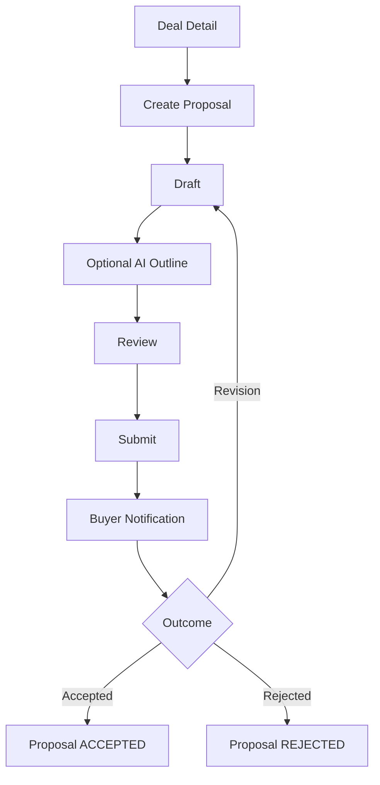

---

## 14. Deal Won

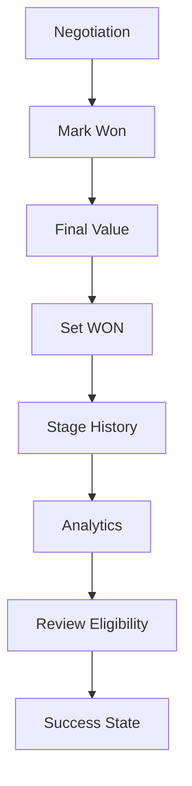

---

## 15. Deal Lost

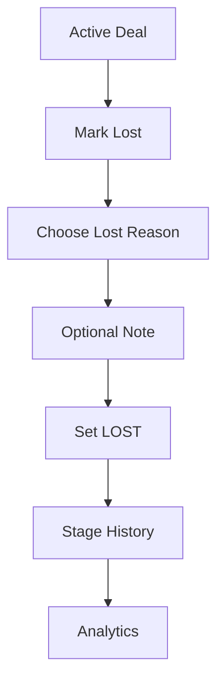

---

## 16. Buyer Provider Comparison

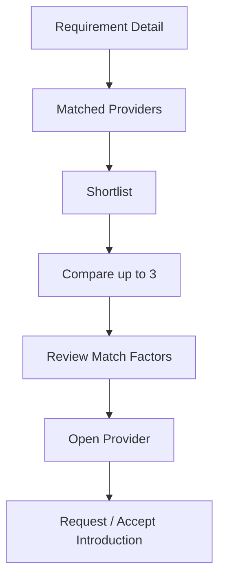

Comparison must not reduce provider selection to price only.

---

## 17. Verification Flow

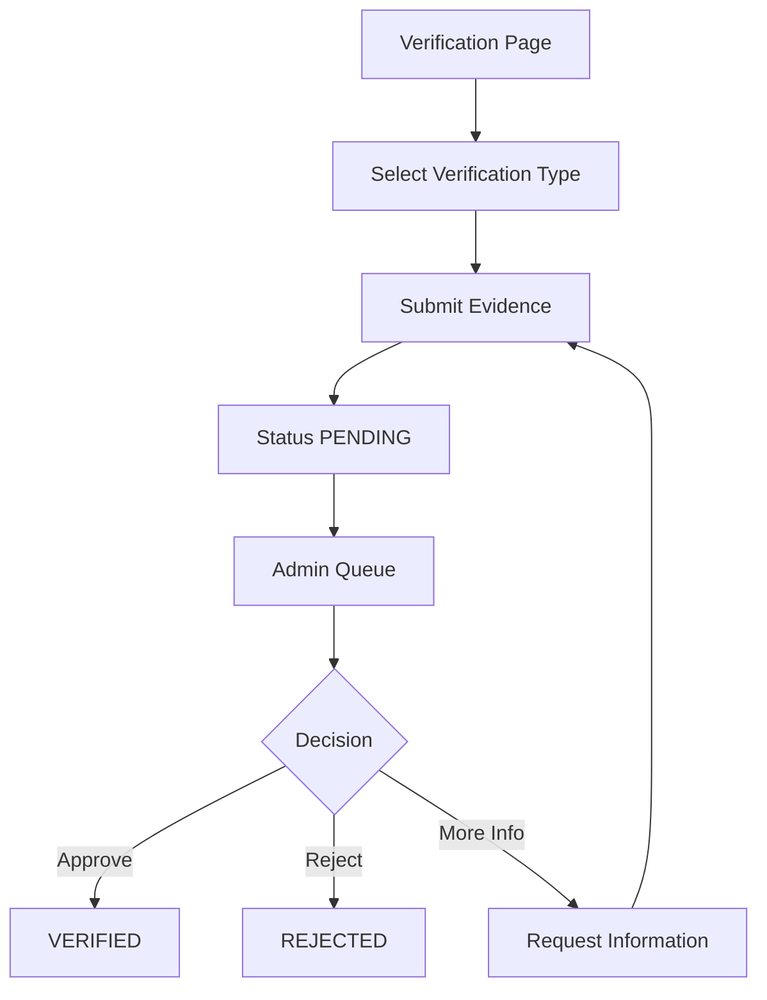

---

## 18. Admin Opportunity Review

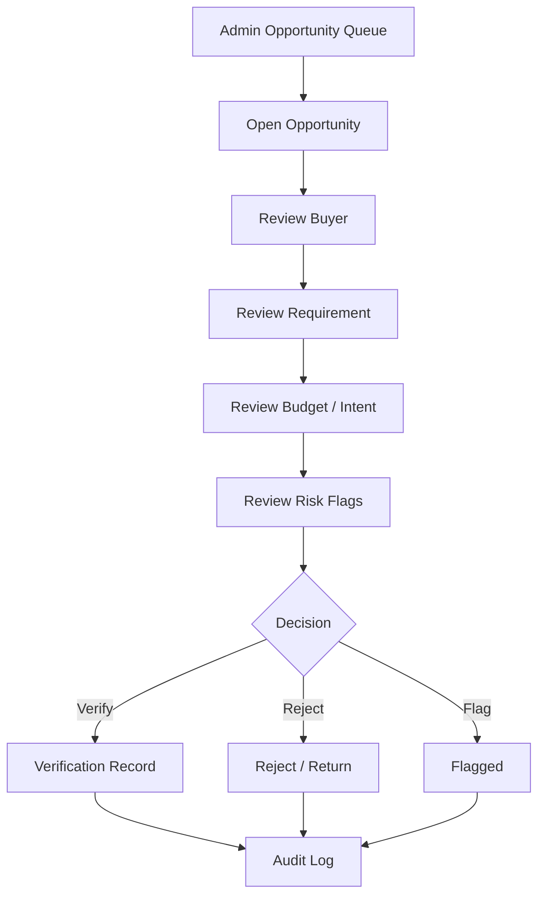

---

## 19. Opportunity Expiration

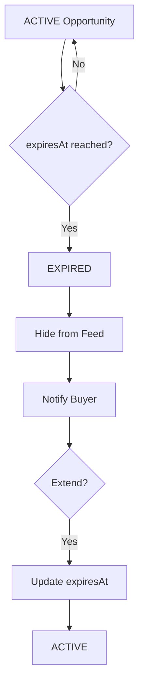

---

## 20. Provider Daily Workflow

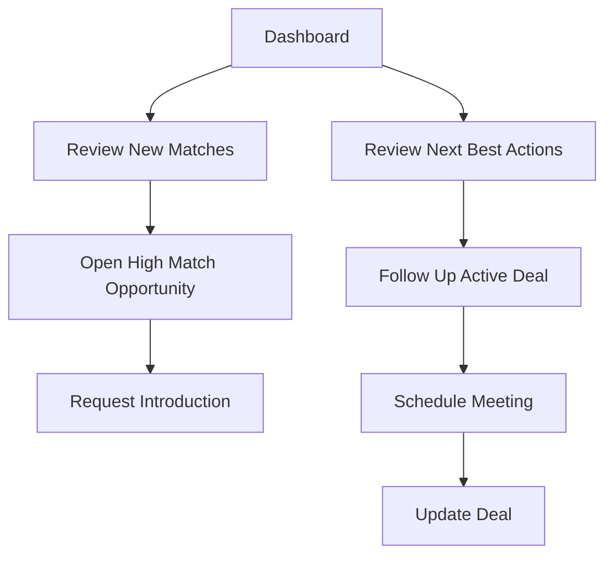

Dashboard should answer: **What should I do today to generate a client?**

---

## 21. Buyer Daily Workflow

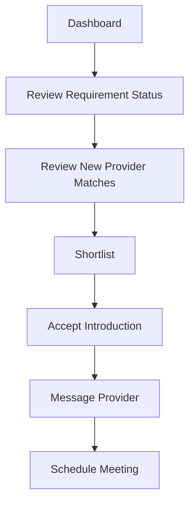

---

## 22. Permission Exceptions

### Provider cannot:
- see buyer private contact before accepted introduction;
- request introduction without eligible opportunity;
- modify buyer requirement;
- access other provider introductions.

### Buyer cannot:
- inspect provider internal deal notes;
- access provider sales analytics;
- alter provider profile.

### Admin can:
- inspect moderation data;
- not impersonate business actions without explicit audited support flow.

---

## 23. Mobile Flow Rules

Mobile prioritizes:
- opportunity cards;
- requirement status;
- messaging;
- next action;
- meeting.

Complex comparison and admin tables may use responsive stacked views.

---

## 24. Article Publication

```mermaid
flowchart TD
    A[Admin prepares Markdown] --> B[Upload .md]
    B --> C[Validate file and frontmatter]
    C --> D[Parse and calculate reading time]
    D --> E[Upsert Article by slug]
    E --> F[Create audit record]
    F --> G{Status PUBLISHED?}
    G -- No --> H[Keep out of public discovery]
    G -- Yes --> I[Render public article]
    I --> J[Include in sitemap, RSS, and llms.txt]
```

Rules:
- only `SUPER_ADMIN` and `ADMIN` mutate;
- `DRAFT` is the default and requires human review;
- uploading the same slug updates rather than duplicates;
- raw HTML is skipped;
- public queries never return draft or archived content.

---

## 25. Related Documents

- `SCREEN_SPECIFICATIONS.md`
- `API_CONTRACT.md`
- `SYSTEM_DESIGN.md`
